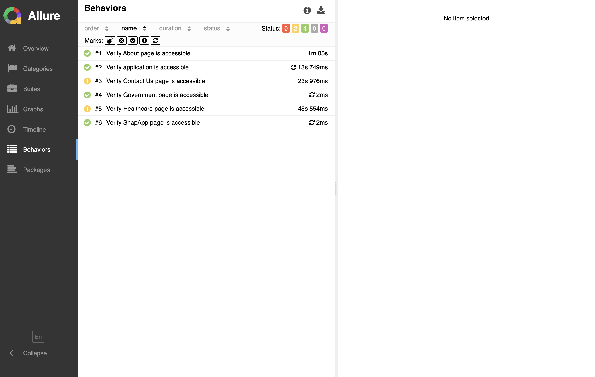
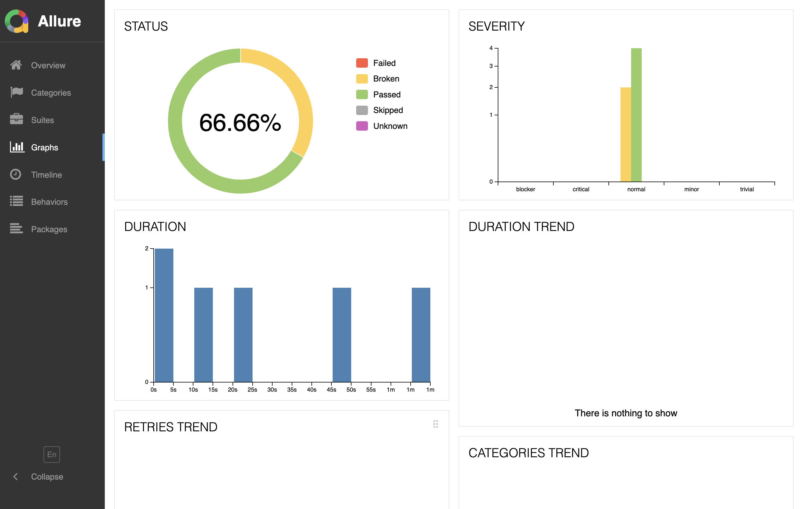
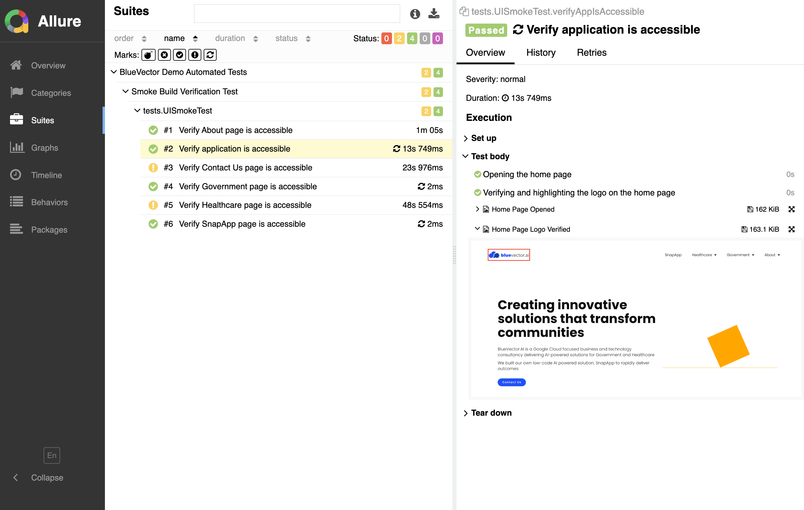

# BlueVector.ai Test Framework

## Overview

This repository contains a robust and production-ready automation test framework tailored for BlueVector.ai. Built on Maven, Selenium WebDriver, TestNG, and Allure Reports, the framework ensures comprehensive test coverage. It utilizes Jenkins for continuous integration to maintain a seamless development and testing workflow. Additionally, DataFaker is incorporated to generate dynamic test data, enhancing the flexibility and robustness of the tests.

## Key Features

- **End-to-End Testing with Selenium WebDriver**
    - Simplified setup and configuration
    - Real-time reloads for quick feedback
    - Automatic waiting for commands and assertions
    - Detailed error messages and stack traces for easy debugging


- **Backend/API Testing with REST Assured**
    - Comprehensive API test cases
    - Validates responses, status codes, and data integrity


- **Continuous Integration with Jenkins**
    - Automated test execution on code commits
    - CI/CD pipeline for seamless integration and deployment


- **Detailed Reporting with Allure Reports**
    - Generates informative and customizable test reports
    - Easy to understand and share test results
    - Visual representation of test behaviors and statuses


- **Dynamic Test Data Generation with DataFaker**
    - Generates realistic test data for better test coverage


- **Well-Organized Code Structure**
    - Clear separation of test cases, configurations, and utilities


## Technologies Used

- **Frontend Testing**: Selenium WebDriver
- **Backend/API Testing**: REST Assured
- **Test Management**: TestNG
- **Continuous Integration**: Jenkins
- **Reporting**: Allure Reporting
- **Version Control**: Git
- **Additional Libraries**: DataFaker for test data generation


# Getting Started

### Prerequisites

- Java 8 or higher
- Maven
- NodeJS (for Jenkins setup)
- Git

### Clone the Repository
    git clone https://github.com/your-username/bluevector-ai-automation-framework.git

### Install Dependencies

    mvn install


### Run Selenium Tests

    mvn test


### View Test Reports


    mvn allure:report


## Automated Script

To run the automated script for executing tests and generating reports, follow these steps:

1. Ensure all dependencies are installed and the environment is set up.


2. Execute the following command to run the tests and generate the Allure report:

    ```bash
    ./src/test/scripts/runTests.sh
    ```


3. The script performs the following actions:
  - Runs Maven tests
  - Generates the Allure report
  - Cleans up project directories and removes unnecessary files

## Reporting with Allure

Allure Reports provide a detailed and comprehensive view of the test execution process. The key features include:

- **Graphical Representation of Test Behaviors**: Visual graphs and charts that showcase the behavior of tests over time.





- **Status Breakdown**: Clear and concise breakdown of test statuses, helping in identifying flaky tests and overall stability.





- **Detailed Test Steps**: Each step within a test case is documented with additional information such as screenshots and logs.



- **Historical Data**: Maintains historical data for better analysis and tracking of test suite performance over time.


## License

This project is licensed under the use of Louis Horqque for Demo Purpose towards BlueVector.Ai.

This framework aims to provide a seamless and efficient testing experience, ensuring the quality and reliability of applications developed for a demo utilizing BlueVector.ai. Feel free to message me towards any demo inquiries or collaborations. 
